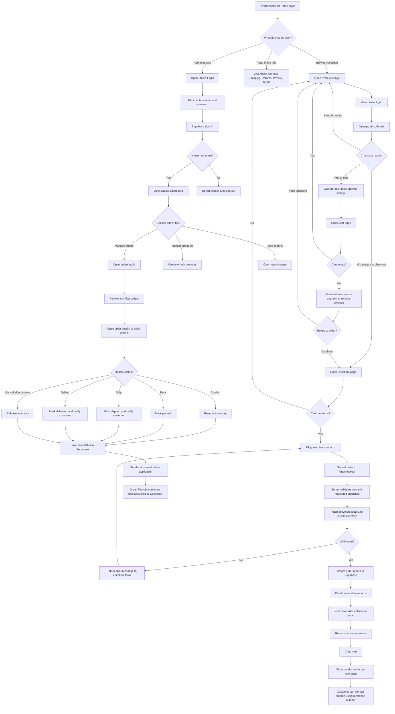

# Kane & Kaori

Kane & Kaori is a fragrance storefront and studio dashboard built for a brand centered on purposeful scent, memory, and everyday ritual. The public site presents the collection and guides customers through a guest checkout flow, while the private studio area gives admins the tools to manage products, monitor orders, and move orders through fulfillment.

## What This Project Does

- Presents the Kane & Kaori brand story and fragrance catalog through a custom Next.js storefront.
- Lets customers browse products, view fragrance details, add items to a persistent cart, and place guest orders.
- Validates checkout requests against live product availability before creating orders.
- Sends order notification and status emails.
- Gives admins a protected studio area for product management, order review, reporting, and fulfillment updates.

## Main User Flows

### Customer experience

1. Land on the homepage and explore the brand story.
2. Browse the fragrance collection on `/products`.
3. Open a product page to review notes, price, and stock.
4. Add items to the cart or go straight to checkout.
5. Submit delivery and payment details through guest checkout.
6. Receive an order reference after a successful submission.

### Admin experience

1. Sign in at `/studio/login` with an admin account.
2. Access the studio dashboard.
3. Create or edit products.
4. Review incoming orders.
5. Move orders through `Pending -> Confirmed -> Packed -> Shipped -> Delivered`, or cancel them when needed.
6. Trigger inventory adjustments and customer email updates as order statuses change.

## Tech Stack

- Next.js 16 with the App Router
- React 19
- TypeScript
- Tailwind CSS 4
- Supabase for auth and data storage
- Resend for transactional email

## Project Structure

```text
src/app                    App Router pages, layouts, and API routes
src/components             UI and feature components
src/hooks                  Client-side state hooks such as cart handling
src/lib                    Shared utilities, Supabase clients, auth, and email helpers
src/services               Product, order, and analytics data access
src/types                  Shared TypeScript models
data                       Local JSON data used during development
docs                       Supporting project docs such as flowcharts
```

## Key Features

- Persistent cart state stored in the browser
- Guest checkout flow with order receipt
- Inventory-aware checkout validation
- Admin-only studio route protection
- Order status transitions with inventory reservation and release
- Email notifications for new orders and fulfillment updates

## Website Flowchart



## Local Development

Install dependencies and start the app:

```bash
npm install
npm run dev
```

Open [http://localhost:3000](http://localhost:3000).

## Environment Variables

Create a `.env.local` file with the required values:

```env
NEXT_PUBLIC_SUPABASE_URL=
NEXT_PUBLIC_SUPABASE_PUBLISHABLE_DEFAULT_KEY=
SUPABASE_SERVICE_ROLE_KEY=
RESEND_API_KEY=
ORDER_NOTIFICATION_EMAIL=
ORDER_FROM_EMAIL=
```

Notes:

- `NEXT_PUBLIC_SUPABASE_PUBLISHABLE_DEFAULT_KEY` can be replaced with `NEXT_PUBLIC_SUPABASE_ANON_KEY` if that is what your Supabase project uses.
- `SUPABASE_SERVICE_ROLE_KEY` is required for server-side order and inventory operations.
- `RESEND_API_KEY` is required for order notification and status emails.
- `ORDER_FROM_EMAIL` is optional. If omitted, the app falls back to a Resend onboarding sender.

## Available Scripts

- `npm run dev` starts the local development server.
- `npm run build` creates a production build.
- `npm run start` runs the production build locally.
- `npm run lint` runs ESLint.

## Important App Areas

- [`src/app/page.tsx`](D:\Passion%20Projects\KaneandKaori\kaneandkaori\src\app\page.tsx) is the storefront landing page.
- [`src/app/checkout/page.tsx`](D:\Passion%20Projects\KaneandKaori\kaneandkaori\src\app\checkout\page.tsx) and [`src/components/checkout/CheckoutForm.tsx`](D:\Passion%20Projects\KaneandKaori\kaneandkaori\src\components\checkout\CheckoutForm.tsx) power guest checkout.
- [`src/app/api/checkout/route.ts`](D:\Passion%20Projects\KaneandKaori\kaneandkaori\src\app\api\checkout\route.ts) handles order validation and creation.
- [`src/app/studio/login/page.tsx`](D:\Passion%20Projects\KaneandKaori\kaneandkaori\src\app\studio\login\page.tsx) handles admin sign-in.
- [`src/app/api/orders/[id]/status/route.ts`](D:\Passion%20Projects\KaneandKaori\kaneandkaori\src\app\api\orders\[id]\status\route.ts) handles order status transitions, inventory changes, and status emails.
- [`docs/website-flowchart.md`](D:\Passion%20Projects\KaneandKaori\kaneandkaori\docs\website-flowchart.md) contains a Mermaid flowchart of the full site journey.

## Purpose

This project is not just an online shop. It is a branded commerce experience for Kane & Kaori, designed to connect storytelling, product discovery, and lightweight order operations in one application.
