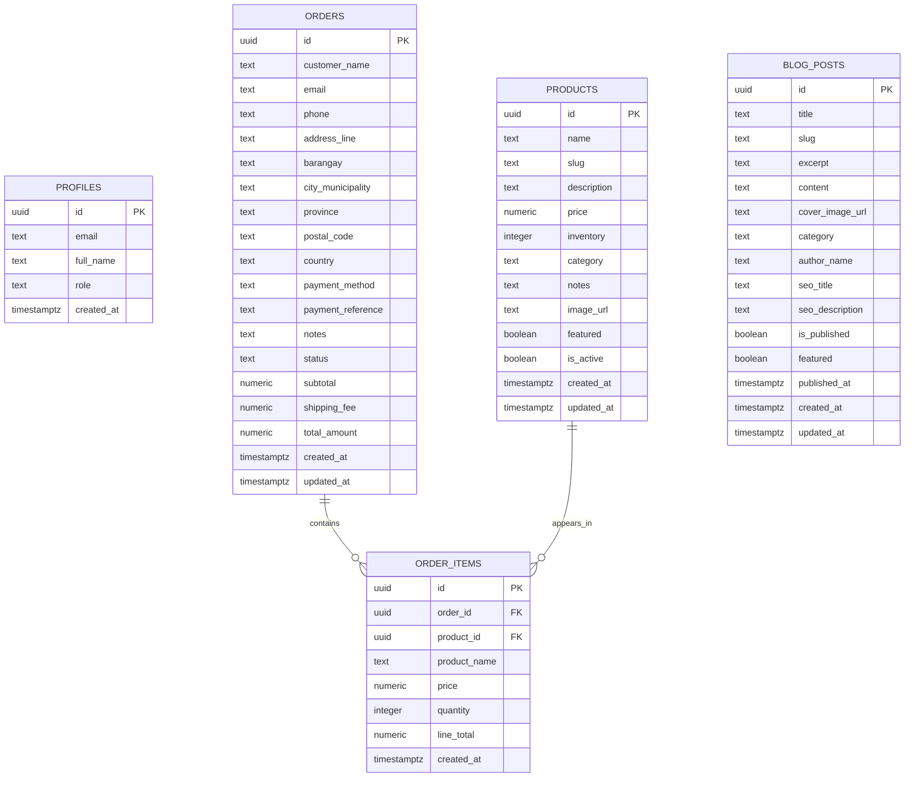
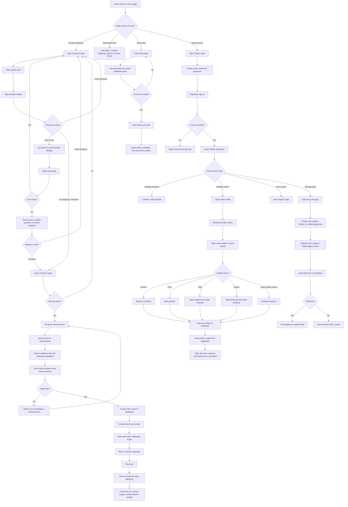

# Kane & Kaori

Kane & Kaori is a branded commerce site built with Next.js for a fragrance label focused on ritual, memory, and becoming. The app combines a public storefront, a protected studio dashboard for operations, and a blog system for editorial publishing.

## Overview

This project currently supports three main surfaces:

- A public storefront for product discovery, cart management, and guest checkout
- A protected studio area for admins to manage products, orders, reports, and blog posts
- A public blog with featured articles, SEO metadata, and structured data

## Core Features

### Storefront

- Home, about, contact, shipping, returns, privacy, and terms pages
- Product listing and individual product detail pages
- Persistent cart state in the browser
- Guest checkout flow
- Inventory-aware order validation before order creation
- Order receipt experience after successful checkout

### Studio Admin

- Admin login backed by Supabase auth
- Protected studio routes
- Product create and edit flows
- Order review and lifecycle management
- Reporting page for operational visibility
- Inventory reservation and release during order status changes

### Blog

- Public `/blog` landing page with featured and recent published posts
- Individual blog post pages at `/blog/[slug]`
- Admin CRUD flow for blog posts inside `/studio/blog`
- Cover image upload to Supabase Storage
- SEO title and description controls per post
- Schema.org metadata for blog index and blog post pages

## Main User Flows

### Customer journey

1. Visit the homepage and explore the brand story
2. Browse fragrances on `/products`
3. Open a product page to review notes, pricing, and availability
4. Add items to cart or continue directly to checkout
5. Submit guest checkout details
6. Receive an order reference after successful order creation

### Admin journey

1. Sign in at `/studio/login`
2. Access the studio dashboard
3. Manage products, orders, reports, and blog posts
4. Update order statuses as fulfillment progresses
5. Create draft or published blog articles and optionally feature them on the blog homepage

## Tech Stack

- Next.js 16 App Router
- React 19
- TypeScript
- Tailwind CSS 4
- Supabase Auth, Database, and Storage
- Resend for order and contact notifications
- EmailJS for the public contact form

### Why this stack

- `Next.js App Router` provides the public website, protected studio routes, API routes, metadata generation, and server-rendered content in one application
- `React` powers the interactive parts of the storefront and studio, especially cart state, forms, and dashboard workflows
- `TypeScript` keeps shared types consistent across pages, services, API routes, and admin tooling
- `Tailwind CSS` supports the custom brand presentation without introducing a separate component framework
- `Supabase` acts as the application backend for authentication, relational data, and blog image storage
- `Resend` is used for operational email delivery tied to orders and contact submissions
- `EmailJS` supports the public-facing contact form workflow from the client side

## Architecture

The application is structured as a single Next.js codebase with three major domains:

- Public commerce experience
- Protected studio operations
- Editorial publishing

At a high level, the architecture follows this pattern:

1. App Router pages define route entry points, layouts, metadata, and server-rendered views
2. Components handle presentation and interactive UI behavior
3. Services encapsulate server-side data fetching and business-oriented read logic
4. API routes handle mutations such as checkout, admin CRUD actions, and order status updates
5. Shared libraries centralize infrastructure concerns such as Supabase access, auth checks, SEO helpers, inventory logic, and email formatting
6. Shared types define the application contracts used across UI and server code

### Architectural principles in this codebase

- Public read flows are generally handled through server components and service functions
- Sensitive operations use server-side Supabase clients backed by the service role key
- Admin mutations are routed through authenticated API endpoints rather than called directly from the browser
- Shared mappers and types normalize Supabase rows into application-friendly objects
- SEO is treated as a first-class concern through shared metadata helpers and structured data generation

## How Development Is Organized

This codebase separates responsibility by user journey and runtime boundary.

### Development workflow

- New public experiences are typically introduced as route segments in `src/app` and composed from feature components in `src/components`
- Shared reads should be added to `src/services` so pages and routes can reuse the same query logic
- Shared infrastructure concerns belong in `src/lib` rather than inside page files
- New admin mutations should be exposed through protected API routes and called from studio components
- Domain shapes should be captured in `src/types` before being reused across UI and server code

### Public product and blog reads

- Product and blog pages primarily use server-side rendering
- Data is fetched through service modules such as [src/services/productService.ts](/D:/Passion%20Projects/KaneandKaori/kaneandkaori/src/services/productService.ts) and [src/services/blogService.ts](/D:/Passion%20Projects/KaneandKaori/kaneandkaori/src/services/blogService.ts)
- Slug-based lookups are supported for both products and blog posts, with UUID fallback where needed

### Checkout and order operations

- The customer checkout UI collects order information on the frontend
- Order creation happens in the checkout API route, not directly in a page component
- Inventory validation occurs before the order is written
- Follow-up lifecycle changes such as status updates and inventory release/reservation are handled through admin-facing route handlers

### Admin workflows

- Studio pages provide the UI layer for operations
- Admin access is validated with bearer-token checks against Supabase auth and the `profiles` table
- Browser-based admin forms call protected API routes for create, update, and delete actions
- Read-heavy reporting logic is centralized in analytics services rather than embedded in page components

### Client-side state

- Long-lived browser state is intentionally limited
- The main shared client state is the cart, implemented through [src/hooks/useCart.tsx](/D:/Passion%20Projects/KaneandKaori/kaneandkaori/src/hooks/useCart.tsx)
- Cart persistence uses local storage so customers can continue browsing without losing selections

## Project Structure

```text
src/app                    App Router pages, layouts, and API routes
src/components             Feature and UI components
src/hooks                  Client-side hooks such as cart state
src/lib                    Shared clients, helpers, auth, SEO, and email utilities
src/services               Server-side data access and domain services
src/types                  Shared TypeScript models
data                       Local JSON seed-style data used in development
docs                       Supporting SQL and project documentation
public                     Public static assets
```

### Directory responsibilities

- `src/app`
  Contains route segments, layouts, route-level metadata, and API route handlers. This is the routing backbone of the application.
- `src/components`
  Contains reusable UI building blocks and feature-level components for storefront, checkout, cart, contact, admin, and layout concerns.
- `src/hooks`
  Contains client-side state helpers. At present this is most notably the cart context and related helpers.
- `src/lib`
  Contains shared infrastructure code such as Supabase clients, admin auth checks, inventory logic, email formatting/sending, SEO helpers, and row mappers.
- `src/services`
  Contains server-oriented data access and reporting logic used by routes and pages.
- `src/types`
  Contains the main domain types for products, orders, blog posts, users, and admin analytics.
- `docs`
  Contains supporting reference material such as SQL and diagrams.
- `data`
  Contains local JSON development data used during earlier or offline-friendly development paths.

## Codebase Reference

### Routing and rendering

- Public pages live in `src/app` and are grouped by route
- Studio routes live under `src/app/studio`
- Protected studio routes live in `src/app/studio/(protected)`
- API routes live alongside pages in `src/app/api`
- Layout composition starts in [src/app/layout.tsx](/D:/Passion%20Projects/KaneandKaori/kaneandkaori/src/app/layout.tsx)

### Services and business logic

- [src/services/productService.ts](/D:/Passion%20Projects/KaneandKaori/kaneandkaori/src/services/productService.ts)
  Handles public product reads and featured product selection
- [src/services/orderService.ts](/D:/Passion%20Projects/KaneandKaori/kaneandkaori/src/services/orderService.ts)
  Handles admin-side order reads, including joined order items
- [src/services/blogService.ts](/D:/Passion%20Projects/KaneandKaori/kaneandkaori/src/services/blogService.ts)
  Handles published blog listing and single-post lookup
- [src/services/adminAnalytics.ts](/D:/Passion%20Projects/KaneandKaori/kaneandkaori/src/services/adminAnalytics.ts)
  Computes dashboard metrics, sales trends, status breakdowns, inventory reports, and top products

### Shared infrastructure

- [src/lib/supabase.ts](/D:/Passion%20Projects/KaneandKaori/kaneandkaori/src/lib/supabase.ts)
  Creates browser, server, and admin Supabase clients
- [src/lib/admin-auth.ts](/D:/Passion%20Projects/KaneandKaori/kaneandkaori/src/lib/admin-auth.ts)
  Verifies admin requests against Supabase Auth and the `profiles` table
- [src/lib/email.ts](/D:/Passion%20Projects/KaneandKaori/kaneandkaori/src/lib/email.ts)
  Builds and sends order and contact notification emails
- [src/lib/seo.ts](/D:/Passion%20Projects/KaneandKaori/kaneandkaori/src/lib/seo.ts)
  Centralizes metadata and absolute URL generation
- [src/lib/supabase-mappers.ts](/D:/Passion%20Projects/KaneandKaori/kaneandkaori/src/lib/supabase-mappers.ts)
  Maps Supabase rows into app-level types

### UI modules

- `src/components/layout`
  Site shell components such as the main navigation and footer
- `src/components/products`
  Product browsing and detail presentation
- `src/components/cart`
  Cart list and summary presentation
- `src/components/checkout`
  Checkout form flow and submission UI
- `src/components/contact`
  Contact form components
- `src/components/admin`
  Admin dashboard panels, data tables, forms, badges, and protected studio UI

## Development Conventions

### Data access conventions

- Use service modules for server-side reads instead of embedding queries across multiple pages
- Use API routes for mutations and protected admin actions
- Use the admin Supabase client only when elevated privileges are required
- Keep row-to-type transformation logic in shared mapper utilities

### Auth conventions

- Public storefront and blog content do not require authentication
- Studio access requires a valid authenticated user with an `admin` role in `profiles`
- Admin APIs expect an authorization bearer token and verify both user identity and role

### Content conventions

- Product and blog routes support human-friendly slugs
- Blog posts remain hidden from the public site until `is_published` is true
- Featured flags are used to influence storefront and blog ordering

### Operational conventions

- Order states are modeled explicitly to support fulfillment tracking
- Inventory is treated as part of order operations, not only product editing
- Notification emails are tied to key order lifecycle events

## Important Routes

### Public

- `/` home page
- `/products` product listing
- `/products/[id]` product detail
- `/cart` cart
- `/checkout` guest checkout
- `/contact` contact form
- `/blog` blog landing page
- `/blog/[slug]` blog article page

### Studio

- `/studio/login` admin sign-in
- `/studio` dashboard overview
- `/studio/products` product management
- `/studio/orders` order management
- `/studio/reports` reports
- `/studio/blog` blog management

## Platform Integrations

### Supabase

- Stores the core commerce and editorial data for products, orders, order items, blog posts, and admin profiles
- Supports admin authentication for protected studio access
- Hosts the `blog-images` storage bucket used for blog cover uploads

### Resend

- Sends order notifications to the business
- Sends customer-facing order status updates during fulfillment
- Supports server-side contact notifications

### EmailJS

- Powers the public contact form submission flow from the website frontend

### SEO and Search Visibility

- Supports canonical URLs and absolute metadata URLs for the main site and blog
- Includes structured data for organization, website, blog index, and individual blog articles
- Supports Google and Bing site verification values for search tooling

## Data Model

The application relies on a central commerce and content schema covering products, orders, order items, blog posts, and admin profiles.

For the blog feature, the related table definition is documented in [docs/blog_posts.sql](/D:/Passion%20Projects/KaneandKaori/kaneandkaori/docs/blog_posts.sql).

For a quick view of how the main entities connect, see the ERD in [docs/database-erd.md](/D:/Passion%20Projects/KaneandKaori/kaneandkaori/docs/database-erd.md).

### Database ERD



### Storage

The blog editor uploads cover images into the `blog-images` bucket and stores the returned public URL on each post.

## Operational Notes

- Blog pages only display posts where `is_published = true`
- Blog posts are ordered by `featured`, then `published_at`, then `created_at`
- The blog editor generates the slug from the post title when saving
- Checkout validates items against current product availability before creating an order
- Order status changes can trigger inventory adjustments and customer notifications
- `next.config.ts` allows remote images from Unsplash and the configured Supabase host

## Key Files

- [src/app/page.tsx](/D:/Passion%20Projects/KaneandKaori/kaneandkaori/src/app/page.tsx) storefront landing page
- [src/app/checkout/page.tsx](/D:/Passion%20Projects/KaneandKaori/kaneandkaori/src/app/checkout/page.tsx) checkout route
- [src/app/api/checkout/route.ts](/D:/Passion%20Projects/KaneandKaori/kaneandkaori/src/app/api/checkout/route.ts) order validation and creation
- [src/app/blog/page.tsx](/D:/Passion%20Projects/KaneandKaori/kaneandkaori/src/app/blog/page.tsx) public blog index
- [src/app/blog/[slug]/page.tsx](/D:/Passion%20Projects/KaneandKaori/kaneandkaori/src/app/blog/[slug]/page.tsx) public blog post page
- [src/app/studio/(protected)/blog/page.tsx](/D:/Passion%20Projects/KaneandKaori/kaneandkaori/src/app/studio/(protected)/blog/page.tsx) admin blog management
- [src/components/admin/BlogPostForm.tsx](/D:/Passion%20Projects/KaneandKaori/kaneandkaori/src/components/admin/BlogPostForm.tsx) blog create and edit form
- [src/services/blogService.ts](/D:/Passion%20Projects/KaneandKaori/kaneandkaori/src/services/blogService.ts) published blog queries
- [docs/website-flowchart.md](/D:/Passion%20Projects/KaneandKaori/kaneandkaori/docs/website-flowchart.md) end-to-end site flow

## Website Flowchart



## Website Flow

The full storefront and studio journey is documented in [docs/website-flowchart.md](/D:/Passion%20Projects/KaneandKaori/kaneandkaori/docs/website-flowchart.md).

## Purpose

Kane & Kaori is more than a storefront. It is a brand system that combines product storytelling, lightweight commerce operations, and now editorial publishing in one application.

