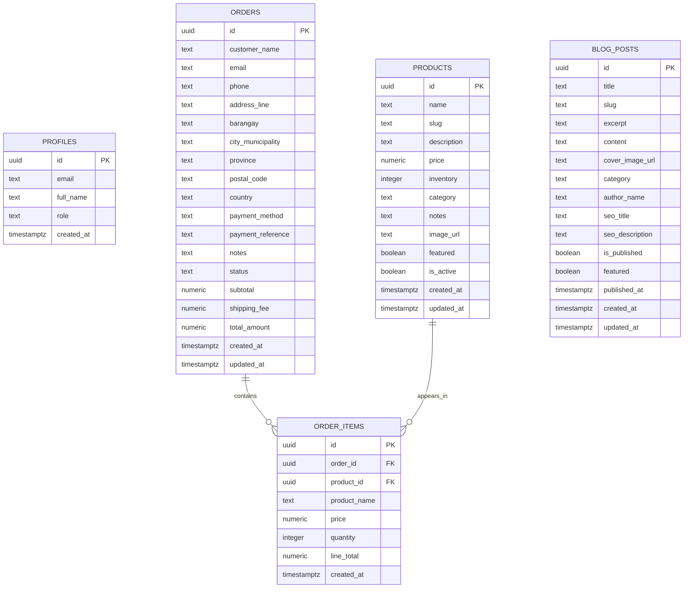

# Kane & Kaori Database ERD

## Notes

- `profiles.id` references `auth.users.id` in Supabase Auth, so that relationship sits outside the public schema shown here.
- `blog_posts` is standalone in the current app and is not linked to a dedicated author table.
- `order_items.product_name` preserves the item name at the time of purchase even if the product record changes later.