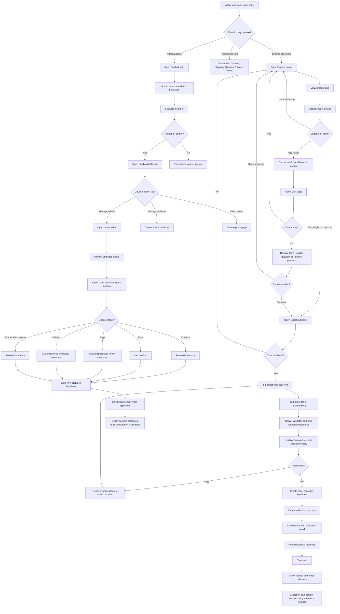

# Kane & Kaori Website Flowchart

```mermaid
flowchart TD
    A[Visitor lands on Home page] --> B{What do they do next?}

    B -->|Browse collection| C[Open Products page]
    B -->|Read brand info| D[Visit About, Contact, Shipping, Returns, Privacy, Terms]
    B -->|Admin access| Z[Open Studio Login]

    C --> E[View product grid]
    E --> F[Open product details]
    F --> G{Choose an action}

    G -->|Add to cart| H[Cart stored in local browser storage]
    G -->|Go straight to checkout| J[Open Checkout page]
    G -->|Keep browsing| C

    H --> I[Open Cart page]
    I --> I1{Cart empty?}
    I1 -->|Yes| C
    I1 -->|No| I2[Review items, update quantity, or remove products]
    I2 --> I3{Ready to order?}
    I3 -->|Keep shopping| C
    I3 -->|Continue| J

    J --> J1{Cart has items?}
    J1 -->|No| C
    J1 -->|Yes| K[Fill guest checkout form]

    K --> L[Submit order to /api/checkout]
    L --> M[Server validates cart and requested quantities]
    M --> N[Fetch active products and check inventory]
    N --> O{Valid order?}

    O -->|No| P[Return error message to checkout form]
    P --> K

    O -->|Yes| Q[Create order record in Supabase]
    Q --> R[Create order item records]
    R --> S[Send new-order notification email]
    S --> T[Return success response]
    T --> U[Clear cart]
    U --> V[Show receipt and order reference]
    V --> W[Customer can contact support using reference number]

    Z --> Z1[Admin enters email and password]
    Z1 --> Z2[Supabase sign-in]
    Z2 --> Z3{Is user an admin?}
    Z3 -->|No| Z4[Reject access and sign out]
    Z3 -->|Yes| Z5[Open Studio dashboard]

    Z5 --> Z6{Choose admin task}
    Z6 -->|Manage products| Z7[Create or edit products]
    Z6 -->|Manage orders| Z8[Open orders table]
    Z6 -->|View reports| Z9[Open reports page]

    Z8 --> AA[Review and filter orders]
    AA --> AB[Open order details or quick actions]
    AB --> AC{Update status?}

    AC -->|Confirm| AD[Reserve inventory]
    AC -->|Pack| AE[Mark packed]
    AC -->|Ship| AF[Mark shipped and notify customer]
    AC -->|Deliver| AG[Mark delivered and notify customer]
    AC -->|Cancel after reserve| AH[Release inventory]

    AD --> AI[Save new status in Supabase]
    AE --> AI
    AF --> AI
    AG --> AI
    AH --> AI

    AI --> AJ[Send status email when applicable]
    AJ --> AK[Order lifecycle continues until Delivered or Cancelled]
```
